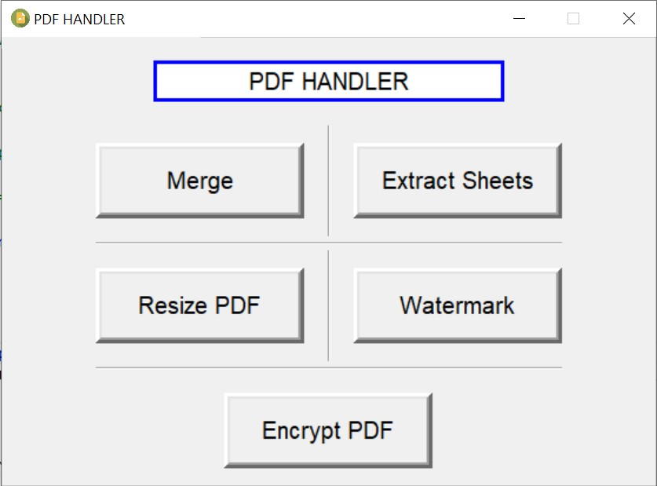
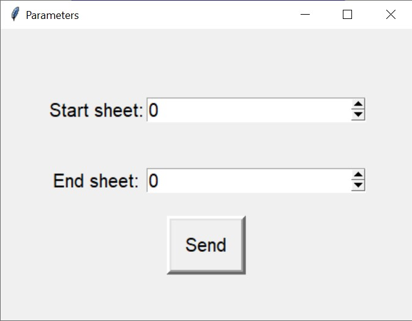
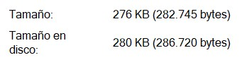
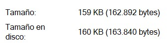
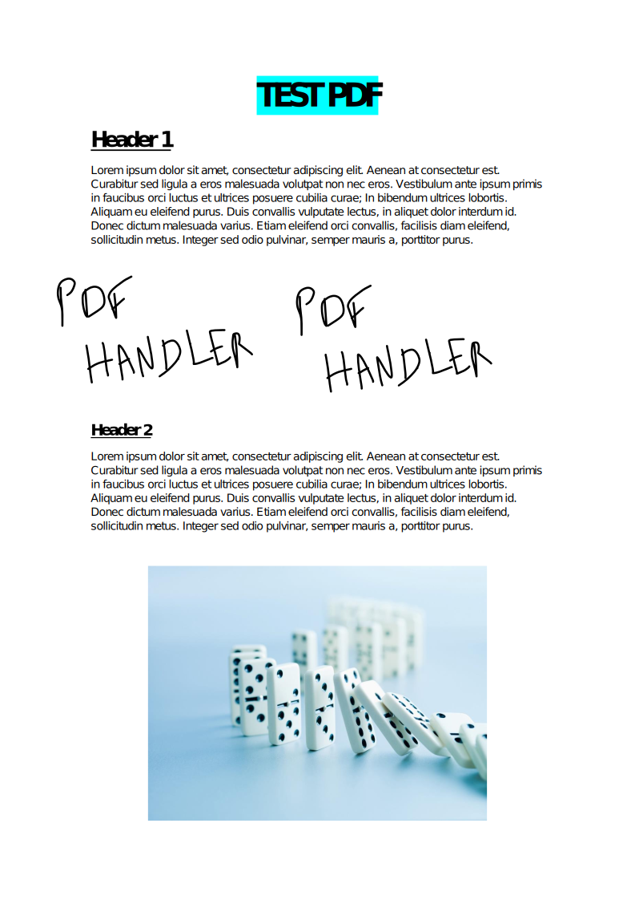
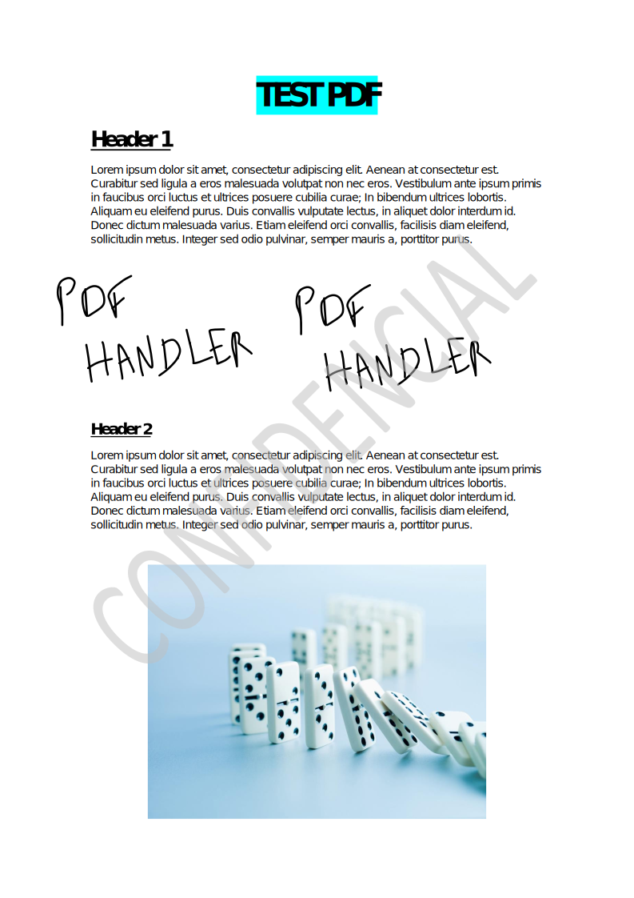
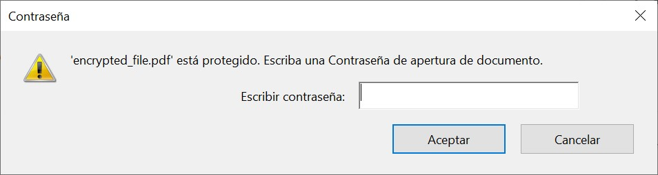
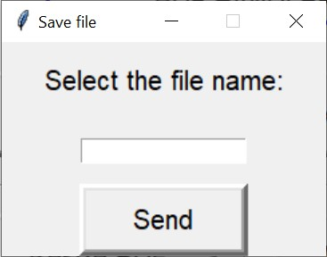
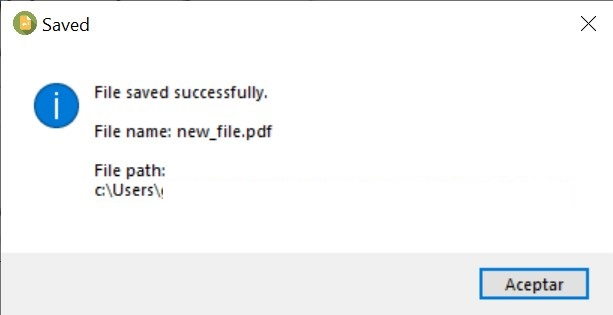
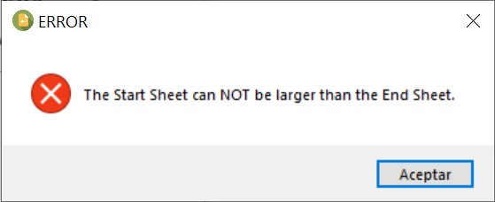

# PDF Handler
[](https://www.python.org/downloads/release/python-3102/)
[](https://code.visualstudio.com/)

A GUI to perform different operations with PDF files.[^1]

## Main window



When a button is pressed, the programme will open a default window of your operating system for file selection.

The available functions are:

## 1. Merge
This function allows you to merge two or more PDF files.
The selection window will let you choose more than one PDF, which will be merged consecutively in alphabetical order.

## 2. Extract sheets
This function allows you to extract one or more sheets from a file.
The selection window will let you choose only one file, then the following window will appear:



Here you can choose which sheet or sheets to extract[^2]. The first sheet of the file is number `0` and the last sheet can be found by clicking on the spin box, since, if we go below `0`, the counter will be positioned on the last sheet of the file.

## 3. Resize PDF
The selection window will let you choose only one file.

This option tries to generate a new file with a smaller size than the original. Applied to the `watermark_added.pdf` file, the following result is obtained:

| Original File | Resized File |
| -- | -- |
| | |

## 4. Watermark
This function adds a watermark to all sheets of the selected PDF file.

The selection window will allow you to choose the `watermark` file first. This file will act as a mark and then you have to choose the file to be watermarked.

| Original File | Watermark | Watermarked File |
| -- | -- | -- |
| | | |

## 5. Encrypt PDF
The selection window will let you choose only one file.

This function generates an encrypted file with a password. Once the file is generated, if we try to open it, the following window will appear:



The password has been set in the code, specifically here:

```python
  writer.encrypt("1234")
```

As you can see the password is `1234`, but you can change it to any other password.

## Save file
Finally, after any function, the following window will appear:



Here you just have to enter the name which you want to save the new file[^3]. The file will be saved in the working folder (where the code is running) and this success message will be displayed:




##### Footer
[^1]: To run [the main program](/pdf_handler.py) you have to download [the file](/icon64.py) containing the logo in base64, however, this is not necessary as it is already collected with an exception.

[^2]: The program will not allow you to choose a `Start sheet` higher than a `End sheet`, generating the following error message.<br></br> 

[^3]: If no name is entered, the file will be named `file_doe.pdf` and if the name entered already exists, `-new` will be added at the end of the name file.


